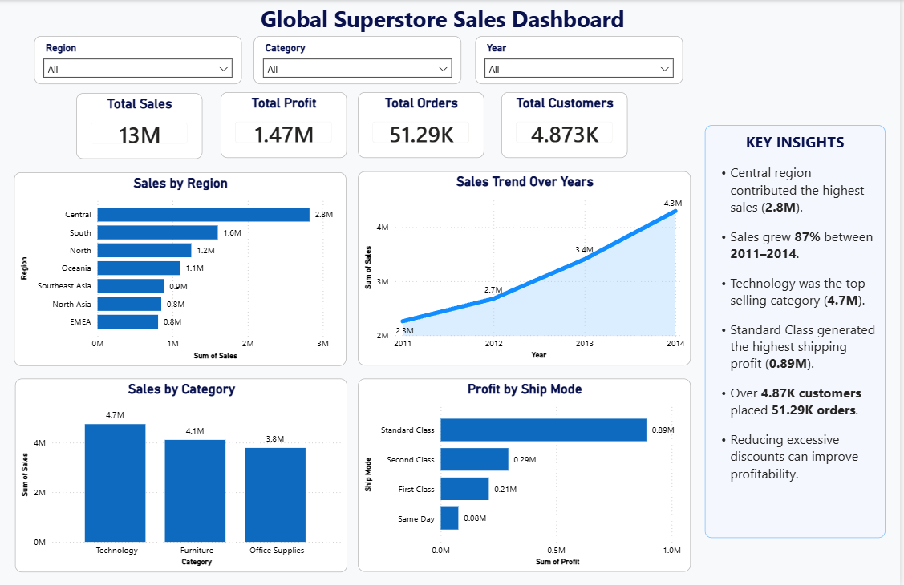

#  Global Superstore Sales Analysis

##  Project Overview

This project analyzes the **Global Superstore** dataset using **Python, MySQL, and Power BI**. The objective is to clean the data, perform Exploratory Data Analysis (EDA), generate business insights using SQL queries, and build an interactive Power BI dashboard to support data-driven business decisions.

---

##  Business Objective

The goal of this project is to answer key business questions such as:

- Which region generates the highest sales and profit?
- Which product categories perform the best?
- Which customers contribute the most revenue?
- How have sales changed over time?
- Which shipping modes are the most profitable?

---

##  Tools & Technologies

- Python
- Pandas
- NumPy
- Matplotlib
- MySQL
- Power BI

---

##  Project Structure

```text
Global-Superstore-Sales-Analysis
│
├── Dataset
│   ├── global_superstore_raw.csv
│   └── superstore_cleaned.csv
│
├── Notebook
│   └── Python_EDA.ipynb
│
├── Dashboard
│   ├── Superstore_Dashboard.pbix
│   ├── Dashboard.pdf
│   └── Dashboard.png
│
├── README.md
├── requirements.txt
└── LICENSE
```

---

##  Dashboard Preview



---

##  Key Business Insights

-  The **Central Region** generated the highest overall sales and profit.
-  **Technology** was the highest-performing product category.
-  Sales showed a consistent upward trend from **2011 to 2014**.
-  **Standard Class** shipping generated the highest profit.
-  High discount levels reduced overall profitability, indicating opportunities for pricing optimization.

---

##  Project Workflow

###  Data Cleaning
- Loaded the dataset using Pandas
- Converted date columns into datetime format
- Removed unnecessary columns
- Checked missing values
- Removed duplicate records

###  Exploratory Data Analysis (EDA)
- Analyzed sales and profit
- Identified top-performing regions
- Evaluated category-wise sales
- Analyzed yearly sales trends
- Found top customers and products

###  SQL Business Analysis
Performed SQL queries to analyze:

- Total Sales
- Total Profit
- Sales by Region
- Profit by Region
- Sales by Category
- Top Customers
- Top Products
- Profit by Shipping Mode

###  Power BI Dashboard
Created an interactive dashboard containing:

- Total Sales KPI
- Total Profit KPI
- Total Orders KPI
- Total Customers KPI
- Sales by Region
- Sales Trend
- Sales by Category
- Profit by Shipping Mode
- Interactive Filters
- Business Insights Panel

---

##  Repository Contents

- ✅ Python Notebook
- ✅ Raw Dataset
- ✅ Cleaned Dataset
- ✅ SQL Analysis
- ✅ Power BI Dashboard (.pbix)
- ✅ Dashboard PDF
- ✅ Dashboard Screenshot

---

##  Skills Demonstrated

- Data Cleaning
- Data Analysis
- Exploratory Data Analysis (EDA)
- SQL Queries
- Data Visualization
- Dashboard Development
- Business Intelligence
- Business Insights
- Power BI Reporting

---

##  Future Improvements

- Build predictive sales forecasting models
- Automate dashboard refresh
- Connect Power BI directly with SQL database
- Add customer segmentation analysis

---

##  Author

**Dhruv Kumar**

Aspiring Data Analyst | Business Analyst | Marketing Analyst

### Connect with Me

- GitHub: https://github.com/dhruv0030
